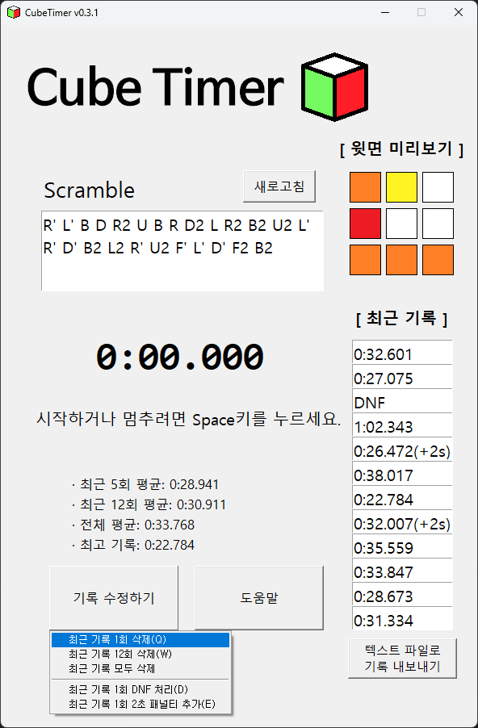

# Cube_Timer

## 소개
* 큐빙 타이머를 파이썬(tkinter)으로 구현하는 프로젝트

## 주요 기능
* 스페이스 키를 눌러 기록 측정
* 스크램블대로 섞었을 때 나오는 큐브의 윗면 형태를 이미지로 표시
* 최근 5회/12회/전체 기록의 평균 표시
* 최고 기록 표시
* 현재 기록을 실격(DNF) 처리하거나 2초 패널티 추가 기능
* 측정된 기록들은 별도의 파일로 관리
* 최근 기록들을 txt파일로 내보내기 기능

## 언젠가 추가할 기능
* 측정 시간을 시:분:초.밀리초 형식으로 표시되게끔 수정
* 15초 미리보기 모드 추가
* 모드 변경 기능(222, 444, 다면체 등등)
* 기록 분석/통계 기능
* UI를 좀 더 깔끔하고 예쁘게....

## 참고자료
* [WCA 공식 사이트](https://www.worldcubeassociation.org/regulations/)
